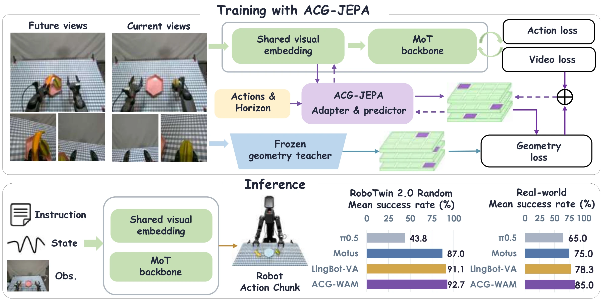
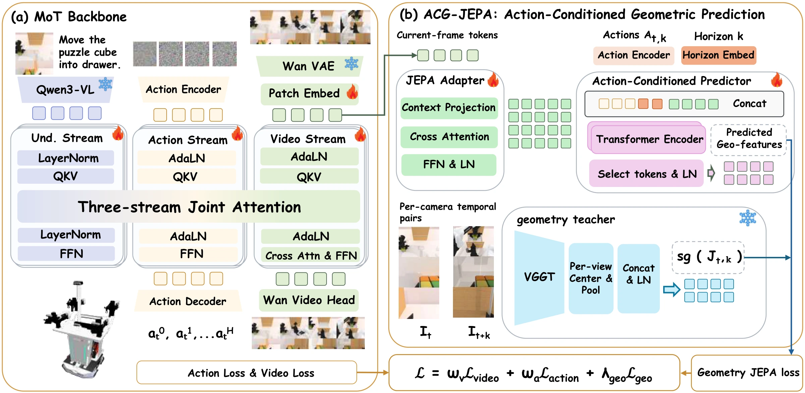
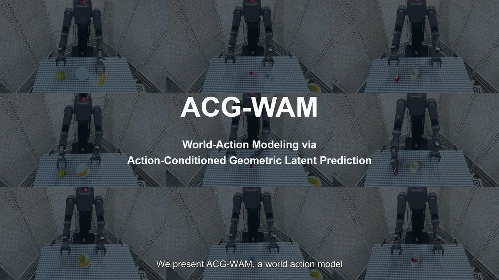
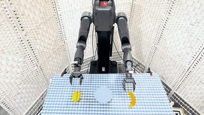
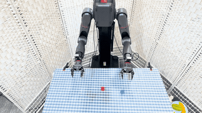
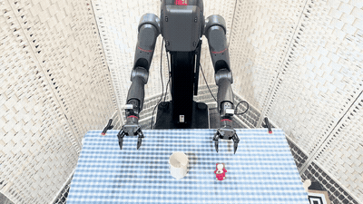
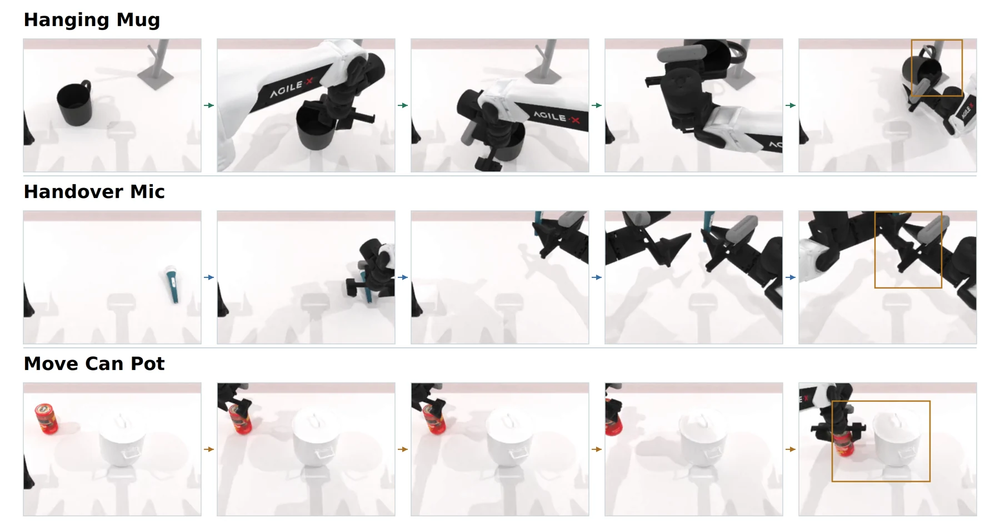

<h1 align="center">ACG-WAM</h1>
<h3 align="center">World-Action Modeling via Action-Conditioned Geometric Latent Prediction</h3>

<p align="center">
  Jiangtao Liu<sup>*</sup>, Zishang Xiang<sup>*</sup>, Yage He, Lingguo Cui,<br>
  Baihai Zhang, Runqi Chai, and Senchun Chai<sup>†</sup><br>
  <sub><sup>*</sup>Equal contribution. <sup>†</sup>Corresponding author.</sub>
</p>

<p align="center">
  <a href="https://RoboOpus.github.io/ACG-WAM/assets/paper/acg-wam.pdf"></a>
  <a href="https://RoboOpus.github.io/ACG-WAM/"></a>
  <a href="https://huggingface.co/RoboOpus/ACG-WAM"></a>
  <a href="https://RoboOpus.github.io/ACG-WAM/#real-world"></a>
  <a href="LICENSE"></a>
</p>

<p align="center">
  <a href="#method"></a>
</p>

**ACG-WAM** teaches a world-action model to predict the geometric consequences of actions. Built on [Motus](https://github.com/thu-ml/Motus), it learns from current observations, demonstrated actions, and geometric targets at multiple horizons, while keeping the backbone's inference path unchanged.

<p align="center">
  <a href="#highlights">Highlights</a> ·
  <a href="#method">Method</a> ·
  <a href="#demonstrations">Videos</a> ·
  <a href="#performance">Results</a> ·
  <a href="#installation">Installation</a> ·
  <a href="#model-downloads">Models</a> ·
  <a href="#training">Training</a> ·
  <a href="#robotwin-evaluation">Evaluation</a> ·
  <a href="#citation">Citation</a>
</p>

## Highlights

- **Action-conditioned geometric prediction.** ACG-JEPA predicts future geometric features from the current observation and the intervening actions, with supervision at horizons **1, 2, 4, and 8**.
- **Geometry from three views.** A frozen VGGT teacher supplies targets from the head and wrist cameras. Supervision updates the policy's shared visual embedding **before temporal mixing**.
- **Strong simulation and real robot results.** ACG-WAM reaches **93.07%** mean success across clean and randomized RoboTwin 2.0 settings, and **85.00%** mean success on three real robot tasks.
- **Training-time supervision.** Teacher targets are cached offline. The teacher, cache, adapter, and predictor are removed at deployment, adding **no auxiliary modules to inference**.

## Method

<p align="center">
  <a href="https://RoboOpus.github.io/ACG-WAM/assets/images/architecture.svg"></a>
</p>

**ACG-JEPA** (Action-Conditioned Geometric Joint-Embedding Predictive Architecture) complements the backbone's video and action losses with a geometric prediction objective:

1. **Construct a geometric target.** For each camera independently, frozen VGGT jointly encodes the current and future images. The future temporal slot is centered and pooled; the three views form a **96 × 768** target.
2. **Predict from the current observation.** The student uses current-frame features from the shared patch embedding, an aligned action prefix, and a horizon embedding. Future images supply teacher targets only.
3. **Train the shared visual representation.** The geometric loss updates the shared embedding alongside the base objectives. Deployment retains the trained policy's original observation and action interface.

See [the paper, Section III](https://RoboOpus.github.io/ACG-WAM/assets/paper/acg-wam.pdf#page=3) for the objective and target construction, and [Joint Teacher Cache](#joint-teacher-cache) for the offline workflow.

## Demonstrations

### Project Video

<p align="center">
  <a href="https://RoboOpus.github.io/ACG-WAM/#overview"></a><br>
  <a href="https://RoboOpus.github.io/ACG-WAM/#overview"><b>▶ Watch the project video</b></a> ·
  <a href="https://RoboOpus.github.io/ACG-WAM/assets/videos/project-overview.mp4">MP4</a>
</p>

### Real Robot

Successful executions on **TRON2 with WUJI hands**. The previews below play at **2× speed**; click a preview for the full video at its original playback speed. Left and right refer to the robot's arms.

<table>
  <tr>
    <th width="33%">Bimanual Fruit Placement</th>
    <th width="33%">Block Stacking</th>
    <th width="33%">Toy Placement into a Cup</th>
  </tr>
  <tr>
    <td align="center"><a href="https://RoboOpus.github.io/ACG-WAM/assets/videos/real/1/IMG_6668.mp4"></a></td>
    <td align="center"><a href="https://RoboOpus.github.io/ACG-WAM/assets/videos/real/2/IMG_6661.mp4"></a></td>
    <td align="center"><a href="https://RoboOpus.github.io/ACG-WAM/assets/videos/real/3/IMG_6651.mp4"></a></td>
  </tr>
  <tr>
    <td align="center"><a href="https://RoboOpus.github.io/ACG-WAM/assets/videos/real/1/IMG_6668.mp4">▶ Demo 1</a> · <a href="https://RoboOpus.github.io/ACG-WAM/assets/videos/real/1/IMG_6670.mp4">Demo 2</a></td>
    <td align="center"><a href="https://RoboOpus.github.io/ACG-WAM/assets/videos/real/2/IMG_6661.mp4">▶ Left arm</a> · <a href="https://RoboOpus.github.io/ACG-WAM/assets/videos/real/2/IMG_6665.mp4">Right arm</a></td>
    <td align="center"><a href="https://RoboOpus.github.io/ACG-WAM/assets/videos/real/3/IMG_6651.mp4">▶ Left arm</a> · <a href="https://RoboOpus.github.io/ACG-WAM/assets/videos/real/3/IMG_6649.mp4">Right arm</a></td>
  </tr>
</table>

### RoboTwin 2.0

<p align="center">
  <a href="https://RoboOpus.github.io/ACG-WAM/#simulation"></a>
</p>

[▶ Browse simulation videos](https://RoboOpus.github.io/ACG-WAM/#simulation) across six tasks, with clean and randomized scenes and multiple demonstrations.

## Performance

### RoboTwin 2.0 — 50 Tasks

Success rates (%) from [Table I of the paper](https://RoboOpus.github.io/ACG-WAM/assets/paper/acg-wam.pdf#page=5). ACG-WAM is evaluated over **100 episodes per task per setting**, using unseen instruction templates and seed 42. Each setting is averaged over all 50 tasks; Mean gives equal weight to Clean and Randomized. Baseline results are taken from the publications identified in the paper.

| Method | Clean | Randomized | Mean |
| :--- | ---: | ---: | ---: |
| GO-1 | 37.80 | 36.24 | 37.02 |
| π₀.₅ | 42.98 | 43.84 | 43.41 |
| X-VLA | 72.80 | 72.84 | 72.82 |
| Motus | 88.66 | 87.02 | 87.84 |
| LingBot-VA | 91.99 | 91.11 | 91.55 |
| MECo-WAM | 93.26 | 91.98 | 92.62 |
| WAM4D | **93.82** | 89.86 | 91.84 |
| **ACG-WAM (ours)** | 93.46 | **92.68** | **93.07** |

ACG-WAM improves on Motus by **4.80 percentage points** in clean scenes and **5.66 points** under randomization, with the best randomized and mean success among these methods.

### Real Robot — Three Tasks

Results from [Table II of the paper](https://RoboOpus.github.io/ACG-WAM/assets/paper/acg-wam.pdf#page=7) on TRON2 with WUJI hands. Each policy is fine-tuned for **15k updates** using **100 demonstrations per task**, then evaluated over **20 trials per task**. SR is full task success; PCS is partial completion score, normalized from scores of 0, 1, or 2.

| Method | Fruit Placement SR | Block Stacking SR | Toy into Cup SR | Average SR | Average PCS |
| :--- | ---: | ---: | ---: | ---: | ---: |
| π₀.₅ | 65.00 | 55.00 | 75.00 | 65.00 | 75.00 |
| LingBot-VA | 75.00 | 65.00 | **95.00** | 78.33 | 84.17 |
| Motus | 70.00 | 70.00 | 85.00 | 75.00 | 82.50 |
| **ACG-WAM (ours)** | **85.00** | **75.00** | **95.00** | **85.00** | **91.67** |

The task averages exceed Motus by **10.00 points in SR** and **9.17 points in PCS**. These experiments use task-specific real robot fine-tuning; the publicly released checkpoint below is the **RoboTwin 40k policy**.

<details>
<summary><b>Ablations: geometric targets, action conditioning, and prediction horizons</b></summary>

All variants train for **8k updates on the same six tasks**, with 100 evaluation episodes per task per setting. These results are separate from the 50-task benchmark above; see Tables III–IV in the paper.

| Variant | Clean | Randomized | Mean |
| :--- | ---: | ---: | ---: |
| Joint, short horizon {1} | 79.33 | 79.17 | 79.25 |
| Joint, long horizon {8} | 82.17 | 80.67 | 81.42 |
| Endpoint residual | 79.83 | 81.00 | 80.42 |
| Joint, no actions | 83.00 | 80.83 | 81.92 |
| **Joint, action-conditioned, horizons {1, 2, 4, 8}** | **84.67** | **82.67** | **83.67** |

</details>

---

## Installation

Use Linux, Python 3.10, and a CUDA-capable NVIDIA GPU. The commands below follow the Motus reference stack with PyTorch 2.7.1 and CUDA 12.8. FlashAttention requires a compatible CUDA toolkit and compiler. Training examples use four GPUs with ZeRO-1; an unchanged single-GPU launch is not a substitute for this memory-intensive configuration.

```bash
git clone https://github.com/RoboOpus/ACG-WAM.git
cd ACG-WAM

conda create --prefix "$PWD/.venv" python=3.10 -y
conda activate "$PWD/.venv"

python -m pip install --upgrade pip setuptools wheel packaging ninja
python -m pip install torch==2.7.1 torchvision==0.22.1 --index-url https://download.pytorch.org/whl/cu128
python -m pip install flash-attn --no-build-isolation
python -m pip install -r requirements.txt huggingface_hub
```

[`requirements.txt`](requirements.txt) pins the Transformers version and installs VGGT from a specific source revision. VGGT is used by offline cache generation and auditing. Run the remaining commands from the repository root unless a different directory is specified.

## Model Downloads

### Released ACG-WAM Policy

| Checkpoint | Download | Training recipe |
| :--- | :---: | :--- |
| **ACG-WAM-RoboTwin-40K** | [🤗 Hugging Face](https://huggingface.co/RoboOpus/ACG-WAM) | Joint ACG-JEPA · clean + randomized · 40k updates |

Download the Joint JEPA checkpoint trained for 40,000 optimizer updates:

```bash
hf download RoboOpus/ACG-WAM --local-dir ./pretrained_models/ACG-WAM
```

The model repository provides:

```text
pretrained_models/ACG-WAM/
  config.json
  mp_rank_00_model_states.pt
  LICENSE
```

The weight file is approximately **16.09 GB**. Pass the **containing directory**, not the individual weight file, to the checkpoint loader. This download contains model parameters and configuration, **not the optimizer and scheduler state needed for exact training resume**. It does not include demonstrations or teacher-cache data.

### Foundation Models

The WAN VAE/text encoder, architecture configurations, and Qwen processor/tokenizer assets are still needed by the supplied workflows:

```bash
hf download Wan-AI/Wan2.2-TI2V-5B --local-dir ./pretrained_models/Wan2.2-TI2V-5B
hf download Qwen/Qwen3-VL-2B-Instruct --local-dir ./pretrained_models/Qwen3-VL-2B-Instruct
```

For training the released recipe from Motus initialization and generating its teacher cache, also download:

```bash
hf download motus-robotics/Motus --local-dir ./pretrained_models/Motus
hf download facebook/VGGT-1B --local-dir ./pretrained_models/VGGT-1B
```

The Motus initialization and VGGT teacher are not needed when only evaluating the released ACG-WAM policy. Observe the licenses of each upstream model and dataset.

## Data Preparation

Training expects converted RoboTwin demonstrations with matching episode identifiers:

```text
robotwin_dataset/
  clean/
    task_name/
      qpos/
        0.pt
      videos/
        0.mp4
      umt5_wan/
        0.pt
  randomized/
    task_name/
      qpos/
        0.pt
      videos/
        0.mp4
      umt5_wan/
        0.pt
```

- `qpos` contains action/state tensors; this recipe uses 14-dimensional actions and states.
- `videos` contains the three-camera T-layout videos: the main camera occupies the top two-thirds, with left and right wrist cameras below it.
- `umt5_wan` contains precomputed language embeddings for the corresponding episodes.
- The main configuration uses `data_mode: both`, multiple tasks, and no episode-count limit. Keep video frames and robot trajectories aligned throughout conversion.

The conversion entry points are in [`data/robotwin2/robotwin_data_convert`](data/robotwin2/robotwin_data_convert); see also the [upstream conversion guide](https://github.com/thu-ml/Motus/tree/main/data/robotwin2/robotwin_data_convert). Dataset acquisition and conversion are separate from downloading the policy checkpoint. Generate the Joint cache from the same converted videos that will be used for training.

## Training Configuration

The released recipe uses **Joint ACG-JEPA**, initialized from Motus and trained on clean and randomized RoboTwin demonstrations for 40,000 updates.

<details>
<summary><b>Recipe settings and teacher protocol</b></summary>

| Setting | Value |
| --- | --- |
| Main experiment | [`configs/robotwin_joint_full_from_motus_40k.yaml`](configs/robotwin_joint_full_from_motus_40k.yaml) |
| Distributed training | [`configs/zero1.json`](configs/zero1.json), DeepSpeed ZeRO-1 |
| Teacher target | `joint_future_slot` |
| Geometry loss weight | `0.01` |
| Prediction horizons | `1, 2, 4, 8` |
| Teacher target shape | `96 x 768` |
| Backbone receives geometry gradients | Yes (`freeze_wam_for_geo: false`) |

The experiment YAML and the DeepSpeed JSON serve different purposes; **both files are required**. Local dataset, checkpoint, and cache paths must be adapted to your machine.

</details>

Edit [`configs/robotwin_joint_full_from_motus_40k.yaml`](configs/robotwin_joint_full_from_motus_40k.yaml) to replace the original machine-specific paths. Update the corresponding fields as shown below; this is a **partial example**, not a replacement for the full configuration:

```yaml
dataset:
  dataset_dir: /absolute/path/to/robotwin_dataset
model:
  wan:
    config_path: ./pretrained_models/Wan2.2-TI2V-5B
    checkpoint_path: ./pretrained_models/Wan2.2-TI2V-5B
    vae_path: ./pretrained_models/Wan2.2-TI2V-5B/Wan2.2_VAE.pth
  vlm:
    checkpoint_path: ./pretrained_models/Qwen3-VL-2B-Instruct
finetune:
  checkpoint_path: ./pretrained_models/Motus
  load_full_checkpoint: false
resume:
  checkpoint_path: null
geometry_jepa:
  cache_dir: ./cache/vggt_teacher_robotwin_joint_future_slot_v1
```

Keep `geometry_jepa.enable: true`, `target_mode: joint_future_slot`, and the matching teacher protocol:

```text
vggt_tlayout_3view_percam_q32_d768_centered_joint_future_slot_v1
```

The pretrained Motus initialization uses `load_full_checkpoint: false`. To start a **new fine-tuning run from the released ACG-WAM weights**, instead set `finetune.checkpoint_path` to `./pretrained_models/ACG-WAM` and `finetune.load_full_checkpoint: true`, with `resume.checkpoint_path: null`. This is a new run, not an exact continuation of the original optimizer state.

## Joint Teacher Cache

### Generate the Cache

Complete dataset preparation and update the YAML paths before running:

```bash
CUDA_VISIBLE_DEVICES=0 python tools/precompute_vggt_cache.py \
    --config configs/robotwin_joint_full_from_motus_40k.yaml \
    --cache-dir ./cache/vggt_teacher_robotwin_joint_future_slot_v1 \
    --vggt-checkpoint ./pretrained_models/VGGT-1B \
    --target-mode joint_future_slot \
    --batch-size 8
```

This entry point automatically selects Joint generation from the YAML; `--target-mode` makes that choice explicit. It encodes same-camera current/future pairs and stores targets by window and horizon. With the released configuration, each window has a static slot plus horizons `1, 2, 4, 8`, each containing `96 x 768` features. Single-shard generation finalizes the index and manifest automatically.

<details>
<summary><b>Generate the cache across multiple GPUs</b></summary>

For multiple GPUs, run one worker per GPU with the same configuration, cache directory, and `--num-shards N`, and a distinct `--shard-id` from `0` to `N-1`. For example, the following is **worker 0 of 4**; start workers 1, 2, and 3 separately with their matching GPU IDs:

```bash
CUDA_VISIBLE_DEVICES=0 python tools/precompute_vggt_cache.py \
    --config configs/robotwin_joint_full_from_motus_40k.yaml \
    --cache-dir ./cache/vggt_teacher_robotwin_joint_future_slot_v1 \
    --vggt-checkpoint ./pretrained_models/VGGT-1B \
    --target-mode joint_future_slot \
    --num-shards 4 --shard-id 0
```

Only after **all workers finish successfully**, merge their indices:

```bash
python tools/precompute_vggt_cache.py \
    --cache-dir ./cache/vggt_teacher_robotwin_joint_future_slot_v1 \
    --merge-index
```

</details>

### Audit Before Training

```bash
CUDA_VISIBLE_DEVICES=0 python tools/audit_joint_vggt_cache.py \
    --config configs/robotwin_joint_full_from_motus_40k.yaml \
    --cache-dir ./cache/vggt_teacher_robotwin_joint_future_slot_v1 \
    --vggt-checkpoint ./pretrained_models/VGGT-1B \
    --num-windows 32
```

The audit compares cached targets with fresh teacher outputs and probes the temporal-pair construction. Training reads the completed cache; it does not run VGGT. Keep the source videos available for the audit.

**Do not substitute an endpoint-residual cache for a Joint cache.** Changes to the teacher weights, preprocessing, camera order, target construction, feature dimensions, or cached horizons require a compatible protocol and regenerated cache. Do not relabel an existing cache to bypass a mismatch. A cache generated with `--limit-episodes` is only suitable for a matching restricted dataset, not full-data training.

## Training

Launch the main recipe explicitly, after the cache has been generated and audited:

```bash
torchrun --standalone --nproc_per_node=4 train/train.py \
    --deepspeed configs/zero1.json \
    --config configs/robotwin_joint_full_from_motus_40k.yaml \
    --run_name joint_full_seed42 \
    --report_to tensorboard
```

Use this explicit command for the released recipe. Some inherited shell launchers still default to other experiment configurations that are not distributed in this release; inspect and adapt them before use.

| Training setting | Value |
| --- | --- |
| Per-GPU micro-batch | 4 |
| GPUs in the command above | 4 |
| Gradient accumulation | 16 micro-batches |
| Effective global batch | 256 |
| Optimizer updates | 40,000 |
| Learning rate | `5e-5` |
| Warmup updates | 200 |
| Seed | 42 |
| Save interval | 20,000 updates |

Step counts refer to **optimizer updates**, not individual micro-batches. Changing GPU count, micro-batch size, or gradient accumulation changes the effective batch size unless compensated.

With the default output settings, checkpoints and TensorBoard logs are placed under:

```text
checkpoints/robotwin_joint_full_from_motus_40k/joint_full_seed42/
```

```bash
tensorboard --logdir checkpoints/robotwin_joint_full_from_motus_40k/joint_full_seed42/tensorboard_logs
```

Full training checkpoints include optimizer state and are substantially larger than the downloadable model. Before a smoke run, lower `training.max_steps`, restrict the dataset consistently with its cache, and use a separate `system.checkpoint_dir`. Do not start a full 40k run just to test installation.

For an **exact resume**, set `resume.checkpoint_path` to a complete local trainer checkpoint and set `finetune.checkpoint_path: null`. Preserve the compatible model and JEPA configuration. The model-only Hugging Face download is not an exact-resume checkpoint.

## RoboTwin Evaluation

Evaluation uses a separate RoboTwin simulator installation. Follow the [RoboTwin setup instructions](https://github.com/RoboTwin-Platform/RoboTwin), then make its environment able to import the dependencies required by this policy.

The deployment snapshot lives in [`inference/robotwin/Motus`](inference/robotwin/Motus). Its internal policy name remains **`Motus`** for compatibility with the evaluator; loading the ACG-WAM checkpoint selects the released policy weights.

Set `ROBOTWIN_ROOT` to your simulator checkout and copy the policy into an unused destination:

```bash
export ROBOTWIN_ROOT=/absolute/path/to/RoboTwin
test -d "$ROBOTWIN_ROOT/policy" &&
test ! -e "$ROBOTWIN_ROOT/policy/Motus" &&
cp -a inference/robotwin/Motus "$ROBOTWIN_ROOT/policy/Motus"
```

If `policy/Motus` already exists, inspect and back it up or merge it deliberately instead of overwriting it blindly. In the **copied** policy's [`paths_config.yml`](inference/robotwin/Motus/paths_config.yml), replace the path placeholders:

```yaml
robotwin_root: /absolute/path/to/RoboTwin
conda_env: /absolute/path/to/your/compatible/conda/environment
checkpoint_path: /absolute/path/to/ACG-WAM/pretrained_models/ACG-WAM
wan_path: /absolute/path/to/ACG-WAM/pretrained_models/Wan2.2-TI2V-5B
vlm_path: /absolute/path/to/ACG-WAM/pretrained_models/Qwen3-VL-2B-Instruct
task_config: demo_randomized
seed: 42
```

`checkpoint_path` must point directly to the directory containing `mp_rank_00_model_states.pt`. Edit `TASK_NAME` and `GPU_ID` near the top of the copied [`eval.sh`](inference/robotwin/Motus/eval.sh), then run:

```bash
bash "$ROBOTWIN_ROOT/policy/Motus/eval.sh"
```

The policy loader uses `strict=False` with its JEPA-free deployment model. Auxiliary JEPA parameters in the training checkpoint are not needed at deployment; neither VGGT nor the teacher cache is used for action inference. The WAN VAE/text encoder and Qwen processor assets are still required.

Robot-specific deployment examples are also provided under [`inference/real_world/Motus`](inference/real_world/Motus). These are adaptation starting points, not a claim that the released RoboTwin checkpoint can control an arbitrary physical robot without matching observations, action conventions, calibration, and task-specific validation.

## Validation and Troubleshooting

<details>
<summary><b>Validation commands and common setup issues</b></summary>

Geometry unit tests do not require downloaded model checkpoints:

```bash
python -m pytest tests/test_geometry_jepa.py -q
```

Optional real-model contract tests need CUDA and the corresponding local pretrained models; they skip when those prerequisites are absent:

```bash
python -m pytest tests/test_real_model_contracts.py -q -s
```

| Symptom | Check |
| --- | --- |
| Missing experiment or DeepSpeed config | Use the two published config files and the explicit training command above; do not use inherited launcher defaults. |
| Cache manifest, protocol, or horizon mismatch | Check the Joint protocol, dataset coverage, and completed shard merge. Do not disable cache validation. |
| Out of GPU memory during cache generation | Reduce the cache generator's `--batch-size`; teacher encoding and policy training have different memory requirements. |
| Out of GPU memory during training | Check GPU count and ZeRO-1 setup. Reduce per-GPU micro-batch size and compensate with gradient accumulation if preserving global batch 256. |
| Checkpoint file not found | Pass the containing directory; the published weight file is `mp_rank_00_model_states.pt`. |
| Missing pretrained assets at inference | Check the full WAN directory, including the VAE and T5 assets, and the Qwen processor/tokenizer directory. |
| Exact resume fails with downloaded weights | Use a complete local training-state checkpoint for resume, or initialize a new run using full-checkpoint fine-tuning. |

</details>

## Code Map

<details>
<summary><b>Repository entry points</b></summary>

| Component | Entry point |
| --- | --- |
| Training | [`train/train.py`](train/train.py) |
| Motus backbone and student attachment | [`models/motus.py`](models/motus.py) |
| Geometric adapter, action encoder, and predictor | [`models/geometry_jepa.py`](models/geometry_jepa.py) |
| Offline teacher-cache generation | [`tools/precompute_vggt_cache.py`](tools/precompute_vggt_cache.py) |
| VGGT protocol and joint target construction | [`data/utils/vggt_teacher.py`](data/utils/vggt_teacher.py) |
| Read-only cache loading | [`data/utils/teacher_store.py`](data/utils/teacher_store.py) |
| Joint-cache audit | [`tools/audit_joint_vggt_cache.py`](tools/audit_joint_vggt_cache.py) |
| RoboTwin deployment | [`inference/robotwin/Motus`](inference/robotwin/Motus) |

</details>

## Citation

```bibtex
@unpublished{liu2026acgwam,
  title  = {ACG-WAM: World-Action Modeling via Action-Conditioned Geometric Latent Prediction},
  author = {Liu, Jiangtao and Xiang, Zishang and He, Yage and Cui, Lingguo and Zhang, Baihai and Chai, Runqi and Chai, Senchun},
  year   = {2026},
  note   = {Manuscript},
  url    = {https://RoboOpus.github.io/ACG-WAM/}
}
```

## Acknowledgments and License

ACG-WAM builds on [Motus](https://github.com/thu-ml/Motus), [WAN](https://github.com/Wan-Video/Wan2.2), [Qwen3-VL](https://github.com/QwenLM/Qwen3-VL), [VGGT](https://github.com/facebookresearch/vggt), and [RoboTwin](https://github.com/RoboTwin-Platform/RoboTwin). Please also acknowledge the upstream projects when using their code, models, or datasets.

Repository code is distributed under the [Apache-2.0 license](LICENSE). Upstream weights and datasets remain subject to their respective terms.
